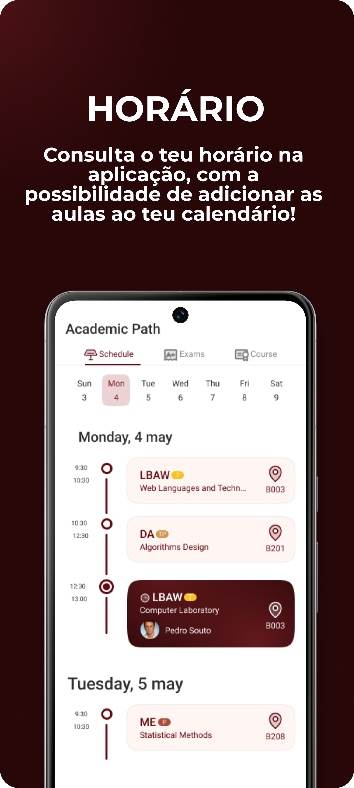
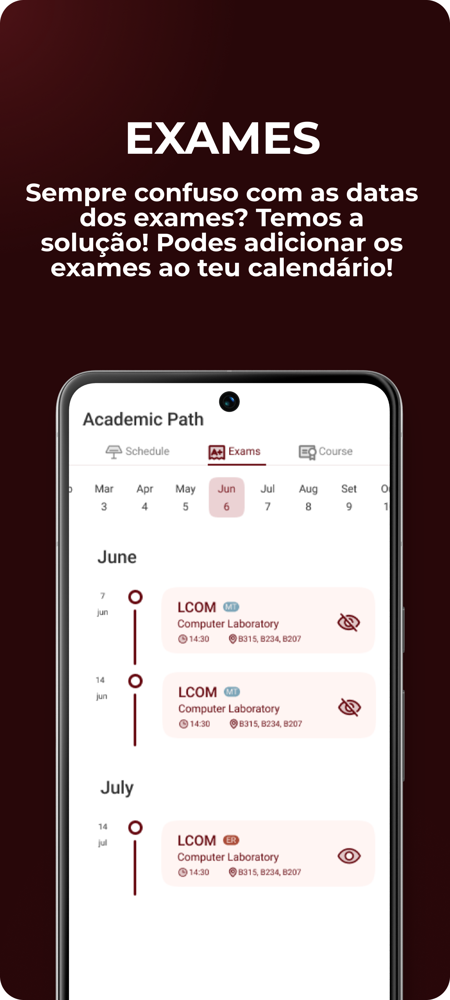
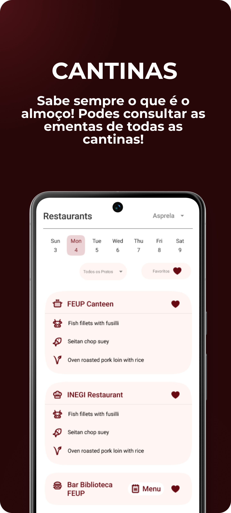
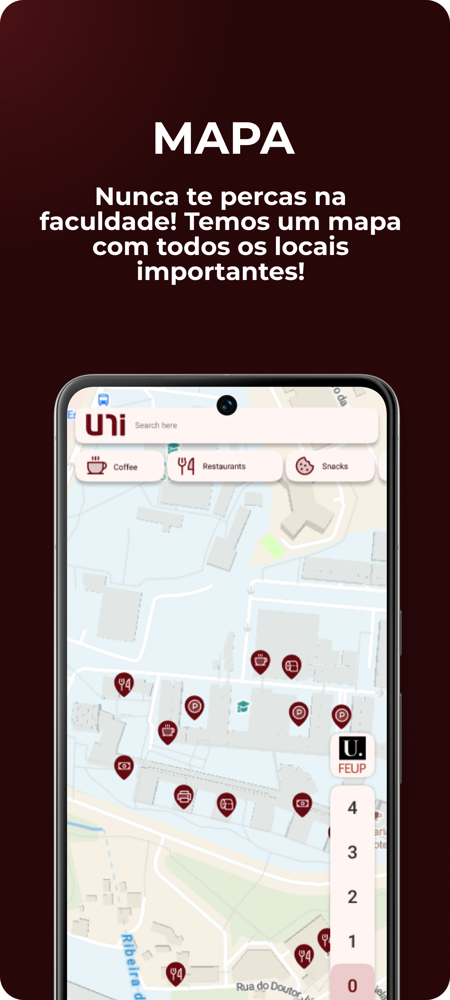

<h3>uni, by NIAEFEUP</h3>

<!-- 

 -->

## Overview

**uni** is a cross-platform mobile application created by [NIAEFEUP](https://niaefeup.pt/) to help students at the University of Porto discover and manage academic information in one place. The app aggregates data from the college platform and other services to provide timely information such as schedules, exams, grades and useful campus resources.

## Screenshots

    
    
    
    
    
    

## Features

- View upcoming classes and exams.
- Access grades and course information.
- View course units details, as well as class colleagues and files.
- Campus restaurants across the whole city.
- Access to important faculty resources.
- Interactive faculty map.

The app requires authentication with an university account and therefore is only available to students. Currently some features are optimized for [FEUP](https://fe.up.pt) students, but an expansion to other faculties is in the works.

## License

This application is licensed under the [GNU General Public License v3.0](./LICENSE). See the `LICENSE` file for details.
## Disclaimer

This app is an independent project and is not officially affiliated with the University of Porto or its faculties. The reliability of the information provided by the app is not guaranteed.

## Contributing