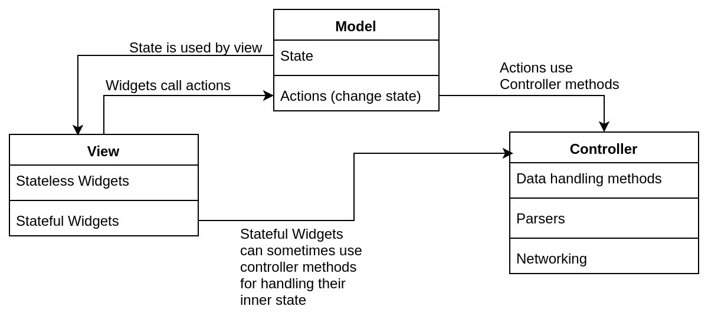

# Project-Schrödinger

## Overall structure

For this project, we are going to be separating the code into Model, View and Controller.
By making sure view-only components are clear from the rest of the code, we can assure safe reuse of widgets as well as separated testing and development.
The state of app pages is stored in the model package, as well as the actions (methods that allow us to update the state), which then use controller's methods.

## View

The View part of the app is made of Widgets (stateful or stateless). They each should deal with their own responsibility (display and/or gather information) and any changes to the overall app should be passed up to their parents (using callbacks) until they reach the current page's widget, where the information will be handled.
**Note:** if a widget's responsibility includes handling information (for example, a date-picking widget that transforms the user input into a date format), it should be done within the widget itself (may or may not use methods in the controller package depending on the complexity of the code)

## Controller

In the controller folder we should only have libraries, classes and methods that process information - Dart only.
The networking side of the app will be in here, as well as the parsers.
Subfolders are crucial to keep the code organized.

## Model
As mentioned before, the Model is responsible for holding the overall state of the app and its pages. For that, we have a model class for each page where the state and actions are located. The state consists of the actual variables that dictate how the application is at a given moment. The actions are methods that allow us to alter and update the state. By passing the actions as arguments to the view widget of a page, we allow its children widgets to update the state.

## Guide and examples
For help with getting started, there are some code examples in the guide_and_examples folder. There you can find stateful widgets, futures and more explained through comments. Any doubt, please contact the project manager.
